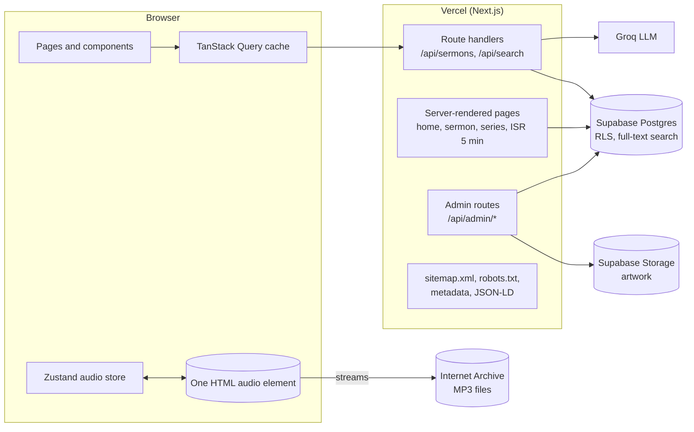

# Messages

**A free sermon library for streaming, searching and sharing the messages of Apostle Muyiwa Areo and the ministers of Muyiwa Areo Ministry International.**

[](https://github.com/asejik/freedom-message/actions/workflows/ci.yml)


**Live site:** https://messages.muyiwaareo.com

---

## Contents

- [About](#about)
- [Features](#features)
- [Tech stack](#tech-stack)
- [Architecture](#architecture)
- [Project structure](#project-structure)
- [Getting started](#getting-started)
- [Available scripts](#available-scripts)
- [Testing](#testing)
- [Deployment](#deployment)
- [Quality standards](#quality-standards)
- [Contributing](#contributing)
- [Content and licence](#content-and-licence)
- [Contact](#contact)

---

## About

Messages is the online home of the ministry's sermon archive. It brings more than **1,400 sermons preached between 2015 and today**, across **200+ series** and **30 ministers**, into one place where anyone can:

- **listen** in the browser, with a player that keeps going while they browse,
- **find** a message by title, preacher, series, year, date or topic,
- **ask** a question in plain language and get an answer drawn from the sermons themselves,
- **share** a sermon on WhatsApp and social media with a proper preview.

Most listeners are in Nigeria, many on mobile data, and the rest are in the diaspora. The site is built for that audience. Pages load fast on mid-range phones, list pages download only what they show, and the audio streams straight from the Internet Archive at no cost to the ministry.

Each sermon comes with an AI-written summary, prayer focus, key Bible verses and topic tags, generated from its full transcript.

The project is built and run by a volunteer for the church.

---

## Features

### For listeners

| Feature | Details |
|---|---|
| **Sermon library** | Featured and Recent shelves, a filterable catalogue (preacher, year, date, topic) and a browsable list of series |
| **Persistent audio player** | Keeps playing across pages. Skip ±15 s, a keyboard-accessible scrubber, volume, buffering and error states with Retry |
| **Lock-screen controls** | Play, pause and seek from the phone's lock screen or headphones (Media Session API) |
| **Resume where you stopped** | Playback position is remembered per sermon on the device |
| **Ask AI** | Natural-language questions ("sermons about overcoming fear") are matched against full transcripts with ranked full-text search. A short written answer links to the most relevant sermons |
| **Sermon pages** | Title, preacher, series, date, AI summary, prayer focus, key verses, tags, download link and "You might also like" |
| **Series pages** | Every sermon in a series, newest first, with a year filter |
| **Favourites** | Save sermons to a personal list, stored on the device. No account needed |
| **Sharing** | Native share sheet or copy link. Every page has a rich preview card |
| **Privacy first** | No visitor accounts and no tracking cookies. A plain-language [privacy notice](https://messages.muyiwaareo.com/privacy) |

### For the ministry's administrators

- **Catalogue management:** add, edit and delete sermons; manage preachers and series, including merging duplicate series.
- **AI enrichment:** generate a summary, tags, key verses and prayer focus for a new sermon from its transcript.
- **Artwork:** images are compressed in the browser to 600×600 WebP and checked by file signature before upload.
- **Backups and logs:** a monthly full backup download with a due-date reminder, an append-only audit log of admin actions, and a log of recent site errors.

Admin access is granted per account by the site owner and enforced on the server and in the database, not just in the interface.

---

## Tech stack

| Layer | Technology |
|---|---|
| Framework | [Next.js 16](https://nextjs.org/) (App Router, Server Components, ISR), [React 19](https://react.dev/), TypeScript (strict) |
| Styling | [Tailwind CSS v4](https://tailwindcss.com/) with OKLCH design tokens; Material Symbols (subset) and [Lucide](https://lucide.dev/) icons |
| Fonts | [Schibsted Grotesk](https://fonts.google.com/specimen/Schibsted+Grotesk) and [Geist](https://vercel.com/font) (SIL Open Font License), self-hosted through `next/font` |
| Client state | [Zustand](https://github.com/pmndrs/zustand) (audio engine) and [TanStack Query v5](https://tanstack.com/query) (data caching) |
| Database and auth | [Supabase](https://supabase.com/): PostgreSQL with Row Level Security, full-text search, Auth and Storage |
| AI | [Groq](https://groq.com/) (search intent and answers); transcripts from [AssemblyAI](https://www.assemblyai.com/) |
| Audio hosting | [Internet Archive](https://archive.org/) |
| Hosting | [Vercel](https://vercel.com/), with Vercel Web Analytics (cookieless) |
| Testing | [Vitest](https://vitest.dev/) (unit), [Playwright](https://playwright.dev/) with [axe-core](https://github.com/dequelabs/axe-core) (end-to-end and accessibility) |
| CI | GitHub Actions |

---

## Architecture



### Key design decisions

- **Server rendering where it matters.** The home, sermon and series pages are rendered on the server and cached for 5 minutes (incremental static regeneration). Content and link previews are in the first HTML response, which helps slow phones, search engines and WhatsApp. If the database is briefly unreachable, those pages fall back to loading their data in the browser.
- **One audio engine.** A single headless `<audio>` element lives in a provider at the root of the app and is synced both ways with a Zustand store. Components subscribe through selectors, so the many updates per second during playback don't re-render the page.
- **Data efficiency.** List queries use explicit column projections that leave out the large transcript field. Search input is debounced. Public API responses are cached at the edge. Images load lazily, and API paging is bounded.
- **Search with graceful fallback.** AI search extracts the topic and preacher from a question, then runs a ranked full-text search over titles, summaries and transcripts in the database. If the AI service is slow or down, the search still works on the raw query.
- **Security in depth.** Authorization is enforced in the database (Row Level Security) and re-checked in every admin route. Stored URLs are scheme-validated before use. Security headers are set on every response, and public errors are generic while details go to server logs.

---

## Project structure

```
.
├── .github/workflows/
│   ├── ci.yml              # typecheck, lint, unit, e2e and accessibility tests
│   └── keep-alive.yml      # daily database ping so the free tier never pauses
└── web/                    # the Next.js application (Vercel root directory)
    ├── e2e/                # Playwright journeys, axe accessibility checks, mocked API
    ├── public/             # icons, web app manifest, share image
    └── src/
        ├── app/            # routes: pages, layouts, API route handlers, sitemap, robots
        │   ├── (home)/     # home page
        │   ├── sermons/[id]/   # server-rendered sermon pages
        │   ├── series/     # series list and server-rendered /series/[id] pages
        │   ├── search/  ai/  favourites/  privacy/  login/  admin/
        │   └── api/        # sermons, search, error reports, admin endpoints
        ├── components/     # UI by area: audio, home, series, sermons, filters, admin, layout, seo, ui
        ├── hooks/          # useDebouncedValue, useFavourite
        ├── lib/            # data access, SEO helpers, search ranking, dates, utilities (unit-tested)
        ├── store/          # Zustand audio store
        ├── types/          # database types
        └── utils/          # Supabase clients (browser, server), image compression
```

Pure logic lives in `src/lib` and `src/utils`, next to its `*.test.ts` file. Route files stay thin.

---

## Getting started

### Prerequisites

- **Node.js 24** (the version CI uses) and npm 11
- A [Supabase](https://supabase.com/) project
- A [Groq](https://console.groq.com/) API key (optional: search works without it, but without AI answers)

### 1. Install

```bash
git clone https://github.com/asejik/freedom-message.git
cd freedom-message/web
npm ci
```

Use `npm ci`, not `npm install --legacy-peer-deps`. Vercel and CI install strictly, and the lock file is the source of truth.

### 2. Configure environment variables

```bash
cp .env.example .env.local
```

| Variable | Used by | Purpose |
|---|---|---|
| `NEXT_PUBLIC_SUPABASE_URL` | browser and server | Supabase project URL |
| `NEXT_PUBLIC_SUPABASE_ANON_KEY` | browser and server | Public anon key (read access, limited by Row Level Security) |
| `SUPABASE_URL` | server only | Supabase project URL for admin operations |
| `SUPABASE_SERVICE_ROLE_KEY` | server only | Admin writes and Storage uploads. **Never expose it to the browser** |
| `GROQ_API_KEY` | server only | AI search and enrichment |

Only `NEXT_PUBLIC_*` values reach the browser. Secrets must never use that prefix.

### 3. Database

The app expects three tables (`preachers`, `series`, `sermons`), two log tables, a few database functions (ranked full-text search and an atomic play/download counter) and an `artwork` storage bucket, all protected by Row Level Security. `web/src/types/database.ts` describes every table and function the app uses.

The SQL migrations aren't published in this repository. To run your own copy with data, contact the maintainer (see [Contact](#contact)).

### 4. Run

```bash
npm run dev
```

Open http://localhost:3000.

---

## Available scripts

Run from `web/`:

| Command | Description |
|---|---|
| `npm run dev` | Start the development server on port 3000 |
| `npm run build` | Create a production build |
| `npm start` | Serve the production build |
| `npm run lint` | Run ESLint |
| `npx tsc --noEmit` | Type-check the project |
| `npm test` | Run the unit tests twice: in the local time zone and in `America/New_York`, so date handling is checked across time zones |
| `npm run test:e2e` | Build the app and run the Playwright suite at desktop and 360px phone width |

---

## Testing

- **Unit tests (Vitest)** cover the pure logic:
  - search ranking, date formatting, paging limits
  - URL safety checks, SEO metadata, sitemap and structured data
  - favourites, the admin access check, file signature detection and backup formats
- **End-to-end tests (Playwright)** walk through real journeys:
  - browse, play, search, filter, open a series, follow an old series link
  - ask the AI, save a favourite, see an error and retry, and the admin redirect
  - every request is mocked, so the tests never touch live data or paid AI services
- **Accessibility tests (axe-core)** check every public page against WCAG 2.2 A/AA at both screen widths.

Playwright needs Chromium's system libraries the first time:

```bash
npx playwright install --with-deps chromium
```

Every push to `main` and every pull request runs the full pipeline in GitHub Actions: type check, lint, unit tests, then end-to-end and accessibility tests.

---

## Deployment

The site is deployed on **Vercel**:

1. Import the repository in the [Vercel dashboard](https://vercel.com/new).
2. Set **Root Directory** to `web`.
3. Add the environment variables from the table above for Production (and Preview, if used).
4. Deploy. Every push to `main` deploys automatically, and any earlier deployment can be promoted back instantly.

A scheduled GitHub Actions workflow pings the database daily, so a free-tier Supabase project is never paused for inactivity. It reads `SUPABASE_URL` and `SUPABASE_ANON_KEY` from the repository's Actions secrets.

---

## Quality standards

| Area | Practice |
|---|---|
| **Accessibility** | WCAG 2.2 AA target: semantic buttons and headings, labelled controls, icons hidden from screen readers, keyboard-operable player, reduced-motion support, automated axe checks in CI |
| **Performance** | Server-rendered key pages with ISR, self-hosted compressed fonts, icon font subset, lazy images, column-limited queries, edge caching of public API responses |
| **SEO and sharing** | Unique titles, descriptions and canonical URLs per page; XML sitemap of every sermon and series; robots.txt; Open Graph and Twitter cards with images; JSON-LD structured data (WebSite, Organization, AudioObject); `noindex` on private pages |
| **Security** | Row Level Security on every table, server-side admin checks, security headers, URL scheme validation, input limits on public endpoints, rate limiting on AI search, upload signature checks, no secrets in client code |
| **Code health** | TypeScript strict mode with unused-code checks, zero `any`, ESLint, small focused modules |
| **Operations** | Error logging (server and browser), append-only audit log, monthly backups with a reminder, daily keep-alive |
| **Privacy** | No visitor accounts, cookieless analytics, preferences kept on the device, AI questions not stored, plain-language privacy notice |

---

## Contributing

This is a volunteer-run ministry project. Suggestions and bug reports are welcome. Please open an issue first to discuss a change.

When contributing code:

1. Keep changes small and focused, and follow the patterns already in the codebase.
2. Make sure `npx tsc --noEmit`, `npm run lint`, `npm test` and `npm run test:e2e` all pass.
3. Use [Conventional Commits](https://www.conventionalcommits.org/) messages, e.g. `fix(player): …` or `feat(seo): …`.
4. Never commit secrets, `.env` files or private data.

To report a security issue, please email the contact address below instead of opening a public issue.

---

## Content and licence

The sermon audio, transcripts, summaries, artwork and the names and logos of Muyiwa Areo Ministry International belong to the ministry. Please don't reuse them without permission.

The source code has no open-source licence yet, so all rights are reserved by default.

---

## Contact

**Muyiwa Areo Ministry International / Citizens of Light Church**
- Website: https://www.muyiwaareo.com
- Sermon library: https://messages.muyiwaareo.com
- Email: info@citizensoflightchurch.org
